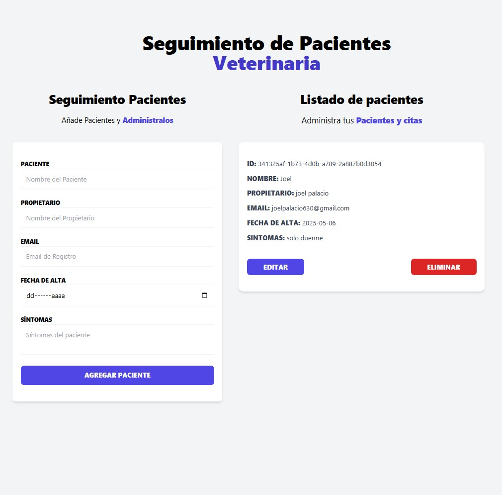

# Administrador de Pacientes



Este proyecto es una aplicación web desarrollada con **React**, **TypeScript** y **Vite**. La aplicación permite gestionar pacientes y sus citas de manera eficiente, proporcionando una interfaz intuitiva y funcional.

## Funcionalidades

- **Listado de Pacientes:** Visualiza una lista de pacientes registrados con sus detalles.
- **Agregar Pacientes:** Permite registrar nuevos pacientes con información como nombre, propietario, email, fecha de alta y síntomas.
- **Editar Pacientes:** Actualiza la información de un paciente existente.
- **Eliminar Pacientes:** Elimina pacientes de la lista con confirmación visual.

## Tecnologías Usadas

- **React:** Biblioteca para construir interfaces de usuario.
- **TypeScript:** Superset de JavaScript que añade tipado estático.
- **Vite:** Herramienta de desarrollo rápida para aplicaciones modernas.
- **Tailwind CSS:** Framework de CSS para estilos rápidos y personalizados.
- **Zustand:** Librería para manejo de estado global.
- **React Toastify:** Para notificaciones visuales.

## Estructura del Proyecto

El proyecto está organizado de la siguiente manera:

- **src/components:** Contiene los componentes reutilizables como `PatientDetail`, `PatientForm`, `PatientList`, etc.
- **src/store:** Implementa el manejo de estado global con Zustand.
- **src/types:** Define los tipos utilizados en la aplicación.
- **public:** Contiene recursos estáticos como imágenes.

## Cómo Ejecutar el Proyecto

1. Clona el repositorio:
   ```bash
   git clone <url-del-repositorio>
   ```
2. Instala las dependencias:
   ```bash
   npm install
   ```
3. Inicia el servidor de desarrollo:
   ```bash
   npm run dev
   ```
4. Abre la aplicación en tu navegador en `http://localhost:3000`.

## Vista Previa

La imagen a continuación muestra cómo se ve la aplicación en la web:


## Contribuciones

Si deseas contribuir a este proyecto, por favor realiza un fork del repositorio, crea una rama con tus cambios y envía un pull request. ¡Toda contribución es bienvenida!
